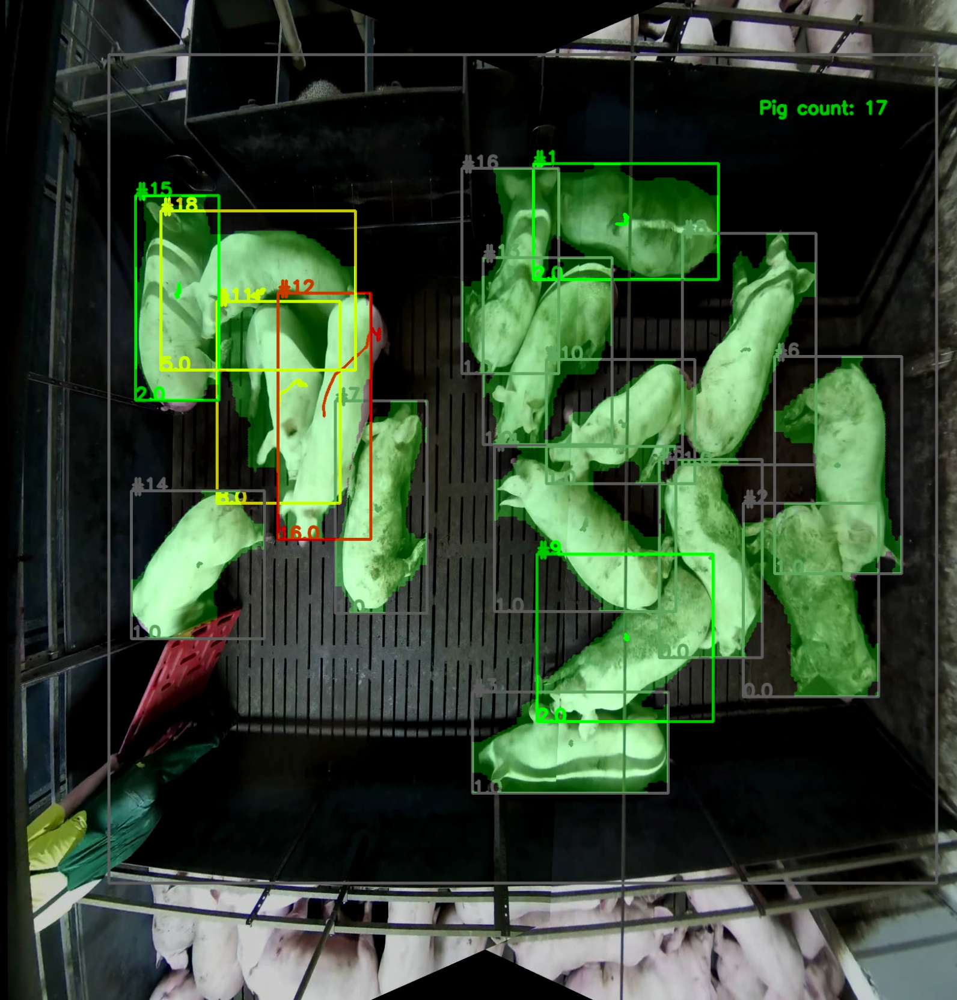

# pig-vision-agrohack2021

### Требования
Данный код запускался и разрбатывался на python3.6 и docker
Чтобы запустить и подготовить окружение необходимо:
- загрузить и распаковать в корень проекта [архив с моделями](https://drive.google.com/file/d/1Ix2a5chTQ6KTo4XXE0JAjfYLDi1XUC4o/view?usp=sharing).

Сделать это можно также используя команду `sh load_models.sh`

-  и установить зависимости `pip install -r requirements.txt`

### Описание
В данном репозитории реализованы модули сегментации, треккинга и отслеживания активности животных на видео.

Запустить обработку видео можно командой:
`python inference.py -v Movie_1.mkv -op output`

Тогда в дирректории `output/` будет создан .hdf5 файл с предиктами результатов сегментации и треккинга для указанного видео.
Также в `output/` будет создано видео с визуализацией работы алгоритма.

### Пример работы
